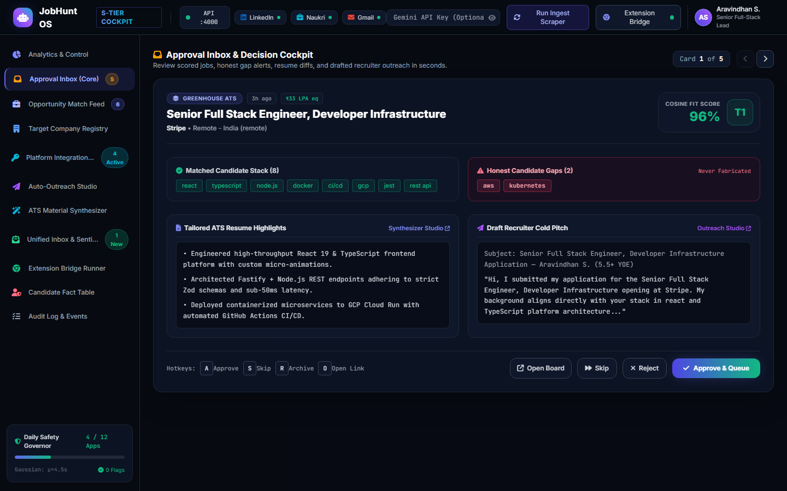
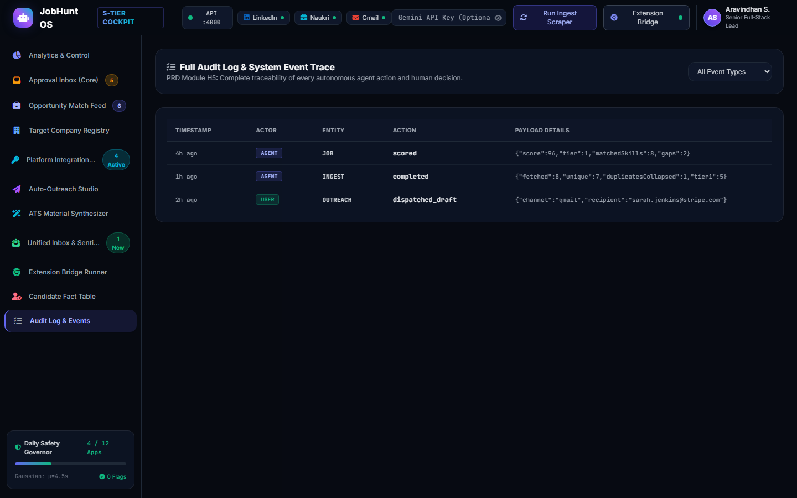
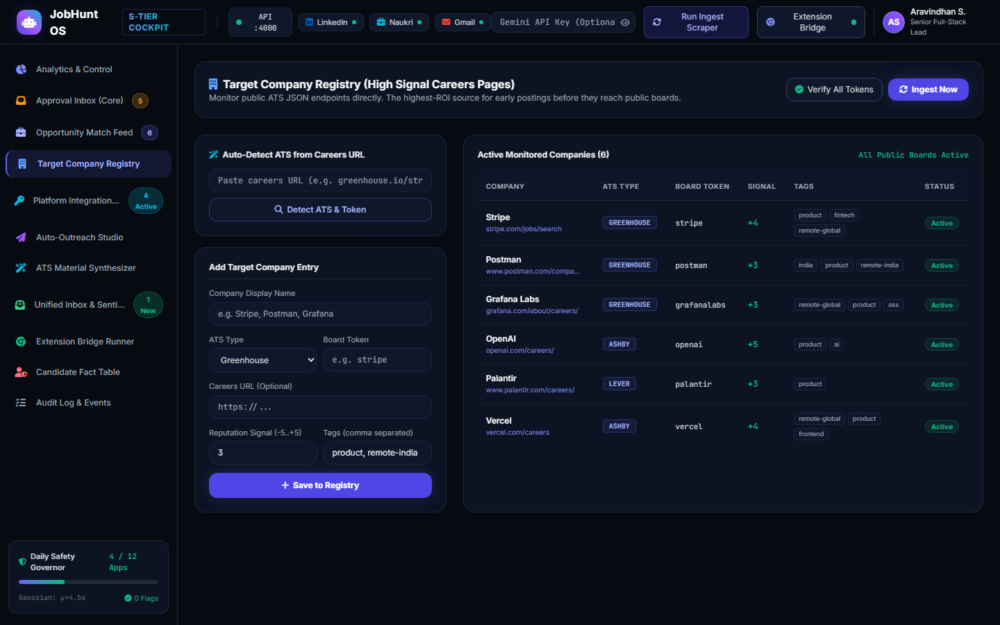
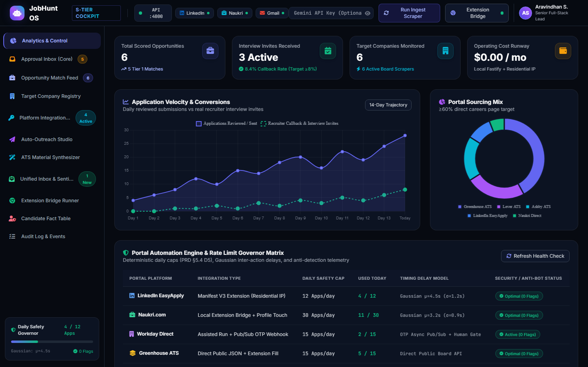
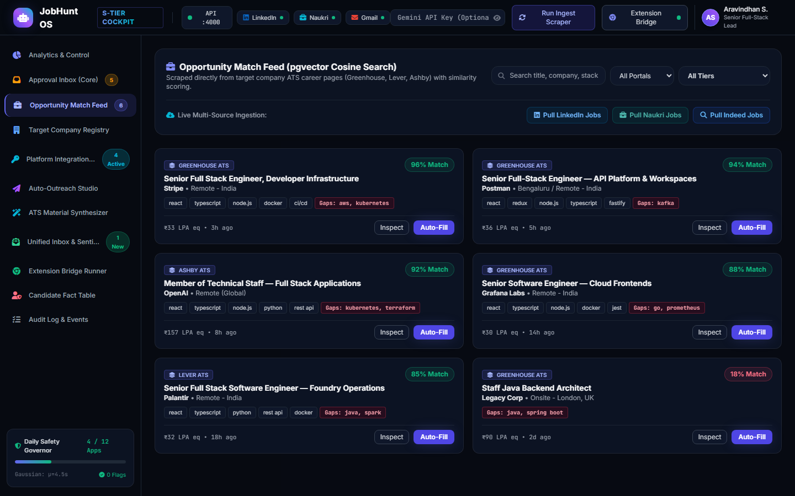
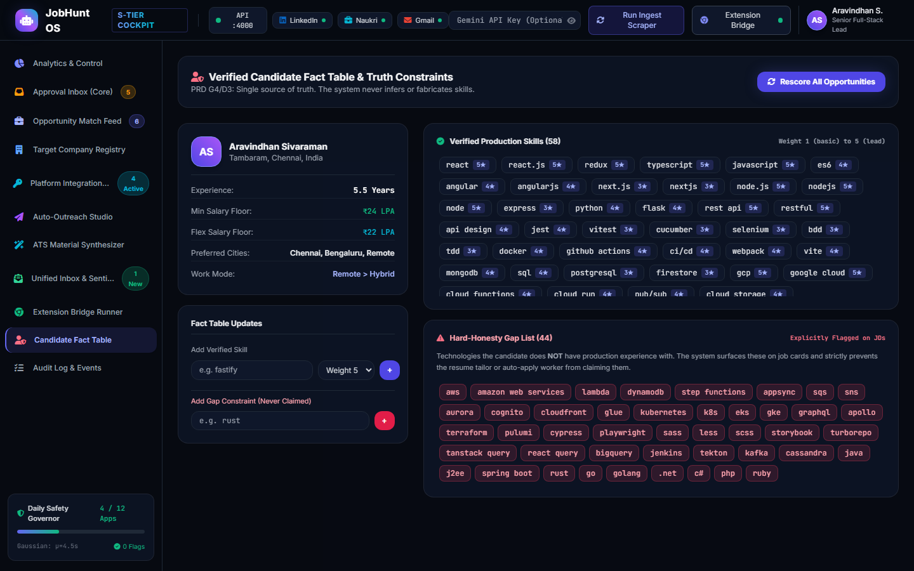

# Working-demo report

Run against the full tree of `legacy/initial-import` (commit `d428610`), which is byte-identical to `main` once PRs #12-#22 are merged. Node v24.19.0, pnpm 10.28.0, Windows 11.

| Check | Result |
|---|---|
| `pnpm install --frozen-lockfile` | OK |
| `pnpm test` (Vitest) | **121 / 121 passed**, 5 files: core 38, connectors 24, db 13, services 12, api 34 |
| `pnpm typecheck` (`tsc --noEmit`) | No errors reported |
| `pnpm cli demo` (offline pipeline on fixtures) | OK: 3 companies, 8 postings, 7 after dedup, 3 Tier 1, 4 filtered out |
| Web console (`vite dev`) | Renders; 6 views screenshotted |

## Caveats
- **Web screenshots use built-in mock data.** The API (`:4000`) and Postgres were not running, so the console fell back to `apps/web/src/lib/mockData.ts`. They prove the UI renders, not the API-to-UI integration.
- The tests ran on the complete tree, not on each PR branch in isolation.
- The browser extension (PR #21) was **not** exercised; it needs loading as an unpacked MV3 extension in a browser profile.
- The API server was not started against a database; the API is covered by `apps/api/src/api.test.ts` (34 tests, PGlite).

## Logs
`logs/vitest.txt`, `logs/typecheck.txt`, `logs/cli-demo.txt`

## Screenshots
### web-approval-inbox

### web-audit-log

### web-company-registry

### web-dashboard

### web-opportunity-feed

### web-profile-fact-table

